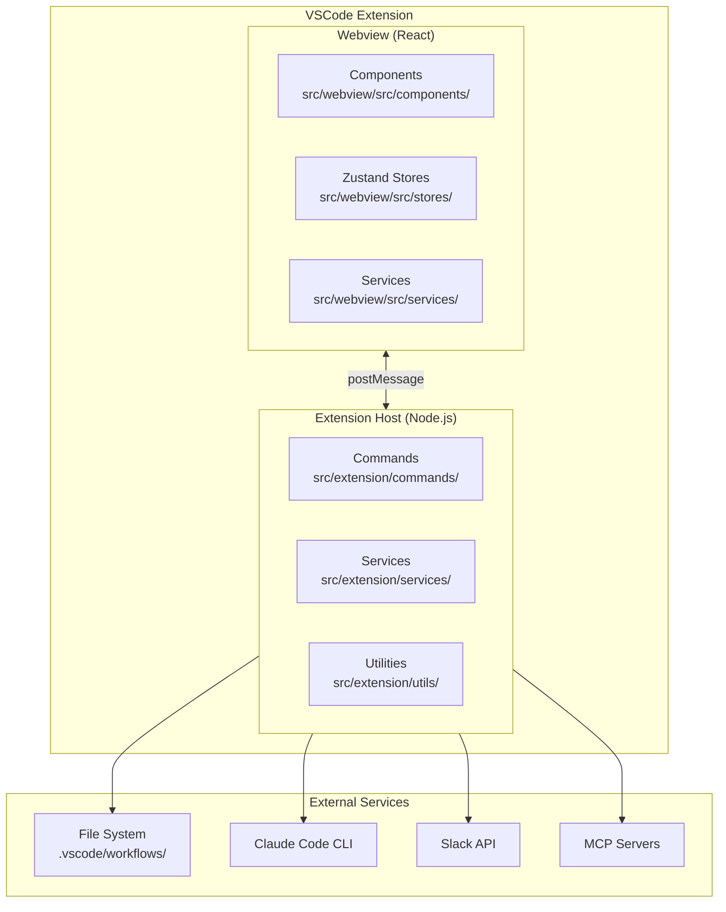
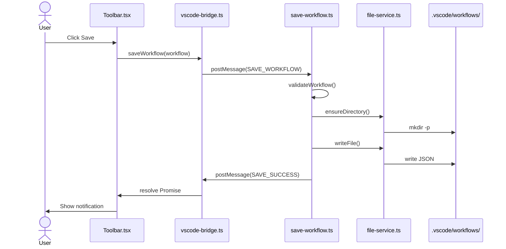
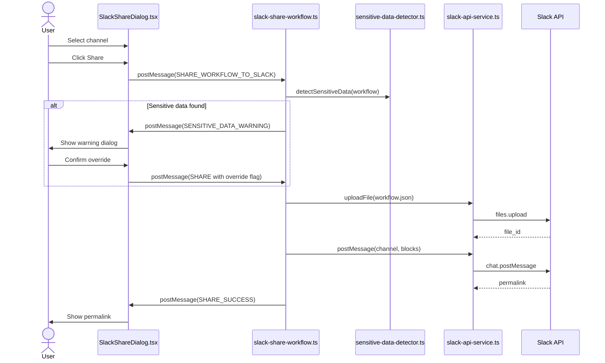
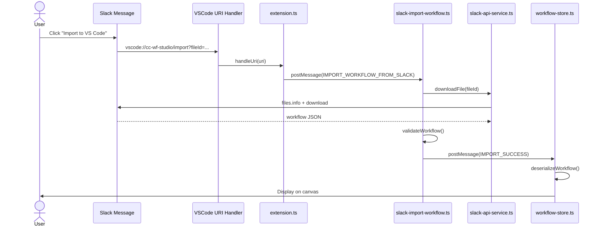
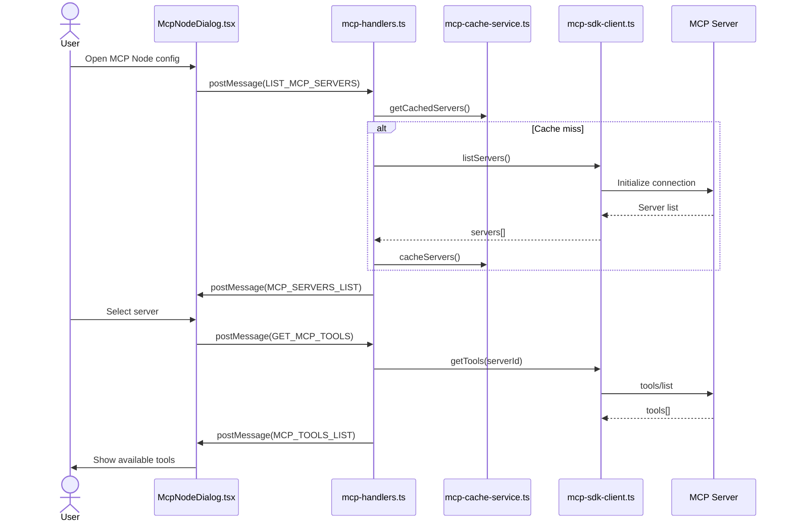
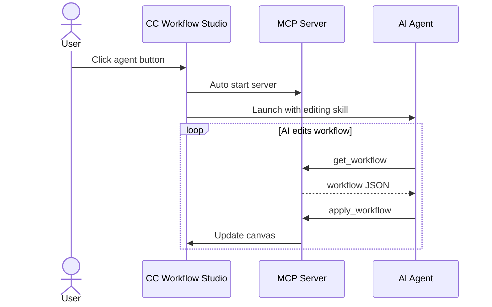

# Architecture Sequence Diagrams

This document describes the main data flows of cc-wf-studio as Mermaid sequence diagrams.

## Architecture overview

## Workflow save flow

## Slack workflow share flow

## Slack workflow import flow (deep link)

## MCP server/tool discovery flow

## AI editing flow (MCP server-based)

